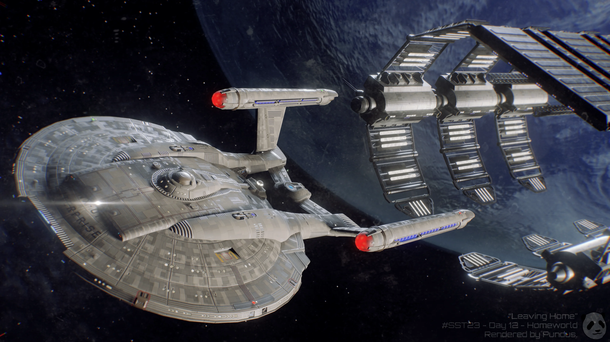

<h1 align="center">
    Starfleet Epsilon Prime Shipyards
</h1>

    <figure style="display: inline-block; margin: 0 auto;">
        
    </figure>

In the heart of the United Federation of Planets, Starfleet Epsilon Prime Shipyards, under Admiral Mara Keldan's leadership, stood as a beacon of innovation. Keldan formed a stellar team, including Commander Renna T'Sol, a skilled engineer, and Lieutenant Soren Marr, an astrophysicist. Together, they revitalized an aging orbital platform, giving birth to the USS Horizon — a groundbreaking starship crafted for scientific exploration.

Admiral Keldan ingeniously integrated the shipyard's processes with the wealth of knowledge from the Star Trek API, navigating the team through Starfleet's rich legacy. Despite formidable challenges, strategic command and unwavering dedication turned setbacks into stepping stones for progress.

As the USS Horizon neared completion, Admiral Mara Keldan reflected on Epsilon Prime Shipyards — more than a ship-construction hub, it embodied the storied legacy of starbases in Starfleet history. Now, on the verge of unveiling the USS Horizon to the galaxy, the ship stands as a testament to the commitment of those safeguarding and exploring the vast frontiers of space.

<table>
<tr>
<td align="center">
<figure>
  
  <figcaption>Admiral Mara Keldan</figcaption>
</figure>
</td>

<td align="center">
<figure>
  
  <figcaption>Commander Renna T'Sol</figcaption>
</figure>
</td>

<td align="center">
<figure>
  
  <figcaption>Lieutenant Soren Marr</figcaption>
</figure>
</td>
</tr>
</table>